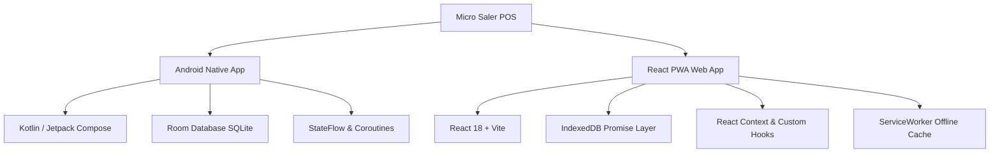

# ⚖️ Micro Saler — Local-First POS & Inventory System

[](https://github.com/drewdroid86/Micro-Saler-/actions/workflows/deploy-pages.yml)
[](https://drewdroid86.github.io/Micro-Saler-/)
[](https://github.com/drewdroid86/Micro-Saler-)
[](https://github.com/drewdroid86/Micro-Saler-)

**Micro Saler** is a high-performance, offline-first Point-of-Sale (POS) and Inventory Management system engineered specifically for market-stall, street vendor, and small-batch mica pigment sales by weight.

👉 **[Launch Live Web App (GitHub Pages)](https://drewdroid86.github.io/Micro-Saler-/)**

---

## 🌟 Key Features

- ⚖️ **Precision Weight Accounting**: Tracks pigment inventory in **milligrams (mg)** to prevent fractional gram drift and inventory discrepancy.
- 💵 **Exact Cents Financial Math**: All pricing, payments, and balances are stored as integer cents to eliminate floating-point rounding errors.
- 📦 **Weighted Average Cost (WAC) Restocking**: Dynamically recalculates Cost of Goods Sold (COGS) on incoming supplier shipments.
- 👥 **Customer House Tabs & Credit Limits**: Manage customer balances, credit limits, and trust status badges (`GOOD_STANDING`, `VIP`, `PAUSED`).
- 🤝 **Handshake Credit Override**: Authorize tab sales exceeding credit limits with mandatory security audit logging.
- ♻️ **Cumulative Partial Returns & Restocking**: Process returns per sale item with automatic inventory restocking.
- 📉 **Spillage & Shrinkage Logging**: Log lost, sampled, or spilled inventory with automatic COGS adjustment.
- 🔒 **Audit Trail**: Immutable audit log for security overrides, voided sales, and pricing updates.
- 📶 **100% Offline-First Architecture**: Operates without any cloud latency or internet dependency.

---

## 🏗️ Dual-Platform Architecture

Micro Saler is implemented across two standalone platforms sharing the exact same business logic specifications:



### 1. Web Application (`webapp-react/`)
- **Framework**: React 18, Vite
- **Storage**: Browser IndexedDB (10 object stores matching Room entities)
- **Styling**: Premium custom CSS design system (`styles.css`) with zero external frameworks
- **PWA Support**: Registered Service Worker (`sw.js`) and Web App Manifest for home screen installation
- **Deployment**: Automatic GitHub Actions deployment to [GitHub Pages](https://drewdroid86.github.io/Micro-Saler-/)

### 2. Android Native Application (`app/`)
- **Language**: Kotlin 2.x
- **UI Framework**: Jetpack Compose & Material 3
- **Database**: Room Database (SQLite)
- **Architecture**: MVVM with `PosViewModel` & `PosRepository`

---

## 📐 Business Logic & Data Specifications

| Domain | Unit | Rule / Specification |
| :--- | :--- | :--- |
| **Weight Units** | Milligrams (mg) | 1 Gram = 1,000 mg (e.g. 84.5g = 84,500 mg) |
| **Monetary Units** | Cents ($) | $1.00 = 100 Cents to avoid floating point errors |
| **Restocking (WAC)** | Formula | $\text{New WAC} = \frac{\text{Current Total Cost} + \text{Received Cost}}{\text{Current Stock mg} + \text{Received mg}}$ |
| **Pricing Modes** | Dual Rates | **RETAIL** vs. **WHOLESALE** per-gram prices + packaging fee |
| **Payment Types** | Flexible | `CASH`, `DIGITAL` (Square, Venmo, Zelle), `HOUSE_TAB` |
| **Split Payments** | Tolerance | Payment total must equal sale total within $\pm 1\text{\textcent}$ |
| **Returns** | Cumulative | Max returnable weight per item cannot exceed $\text{Sold Weight} - \text{Already Returned Weight}$ |

---

## 💾 Data & Backup

Micro Saler stores all data **locally on-device** — IndexedDB (`MicroSalerDB`, schema v4) for the Web PWA or SQLite (Room Database) for Android. There is no server and no cloud sync requirement.

### 📥 Export & 📤 Import Ledger

You can back up and restore your entire POS ledger at any time:

- **Export Ledger Backup**: Generates a single timestamped JSON backup file (`micro-saler-backup-YYYY-MM-DD-HHmm.json`) packaging all 10 IndexedDB object stores (`pigments`, `stock_receipts`, `customers`, `sales`, `sale_payments`, `sale_items`, `returns`, `tab_payments`, `shrinkage_logs`, and `audit_log`).
- **Restore Ledger Backup**: Accepts a backup JSON file, validates schema version compatibility ($\le \text{v4}$), requires explicit confirmation before applying, and repopulates stores preserving original primary key identifiers (`put`).
- **Backup Access**: Click **`💾 Backup / Restore`** in the top navigation header or on the **Audit Log** screen.
- **Startup Data Integrity Check**: Runs automatically on app launch to verify payment totals against line item prices for all completed transactions (tolerating $\pm 1\text{\cent}$ split-payment variance).

---


## 🚀 Getting Started & Local Setup

### Running the React Web Application (`webapp-react/`)

#### Prerequisites
- Node.js (`v18+`)
- npm (`v9+`)

#### Instructions
```bash
# Navigate to webapp-react directory
cd webapp-react

# Install dependencies
npm install

# Run Vite dev server
npm run dev

# Build for production
npm run build
```

The production bundle will be generated in `webapp-react/dist/`.

---

### Running the Android Application (`app/`)

#### Prerequisites
- Android Studio Ladybug or newer
- JDK 17+

#### Instructions
```bash
# Clean and build the Android project
./gradlew assembleDebug

# Run unit tests
./gradlew test
```

---

## 🏷️ Release History

See [CHANGELOG.md](./CHANGELOG.md) for detailed release notes and version history.

---

## 📄 License

Distributed under the MIT License. See `LICENSE` for more information.
